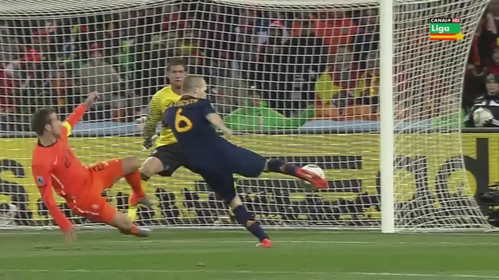
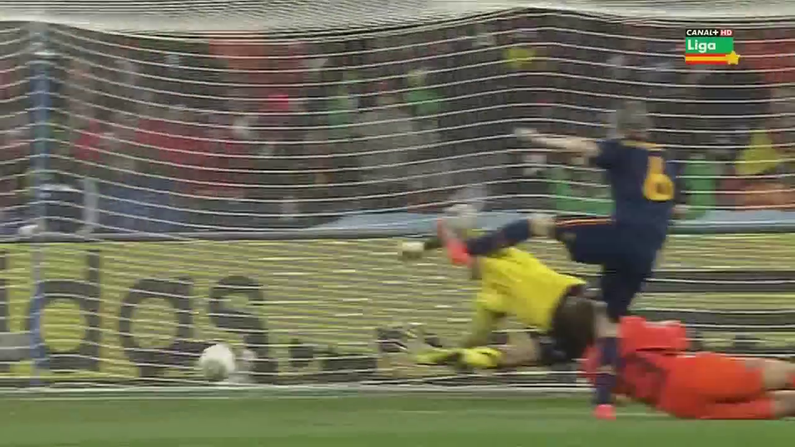

# ToonCrafter docker

Dockerization of the [Hugging Face ToonCrafter Space](https://huggingface.co/spaces/Doubiiu/tooncrafter)

 * Repository: [https://github.com/ToonCrafter/ToonCrafter](https://github.com/ToonCrafter/ToonCrafter)
 * Space: [https://huggingface.co/spaces/Doubiiu/tooncrafter](https://huggingface.co/spaces/Doubiiu/tooncrafter)

With this docker image you can make a video from start frame to end frame.

From this frames

<div style="text-align:center;">
  
  
</div>

To this video

<div style="text-align:center;">
  <video src="assets/video.mp4" poster="assets/start_frame.png" style="width:640px;height:360px;" controls loop>
</div>

## Requisites

[Docker](https://docs.docker.com/desktop/) and [nvidia container toolkit](https://docs.nvidia.com/datacenter/cloud-native/container-toolkit/latest/install-guide.html) must be installed. A GPU with at least 20 GB of VRAM is required.

## Usage

### Download the image from the Docker Hub

You can download the image and run it

```bash
docker pull maximofn/tooncrafter:latest
./run_app.sh
```

### Build the image

Or you can build the image and run it

```bash
./build_docker_image.sh
./run_app.sh
```

